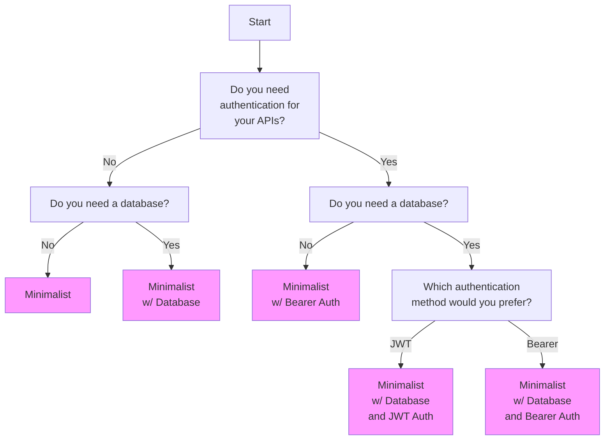

# About

This library provides several different permutations of a bare-bone server using the NestJS framework.

# Permutations

| Permutation                            | Functionalities                                                                              |
| -------------------------------------- | -------------------------------------------------------------------------------------------- |
| Minimalist                             | Environmental Variables, Swagger OpenAPI, Task Scheduler, Logging, and Key Management System |
| Minimalist w/ Bearer Auth              | **Minimalist** + Bearer Authentication                                                       |
| Minimalist w/ Database                 | **Minimalist** + MongoDB                                                                     |
| Minimalist w/ Database and JWT Auth    | **Minimalist w/ Database** + JSON Web Token Authentication                                   |
| Minimalist w/ Database and Bearer Auth | **Minimalist w/ Database** + Bearer Authentication                                           |

# Decision Flow

# Update

## Repository

If there is a need to conduct an upgrade to the different NestJS setups, it is easier to upgrade them in sequence.

1. Upgrade the **Minimalist** permutation
2. Using the **Minimalist** repository and follow the guide to add Bearer Auth
3. Using the **Minimalist** repository and follow the guide to add MongoDB
4. Using the **Minimalist w/ Database** repository and follow the guide to add JWT Auth
5. Using the **Minimalist w/ Database** repository and follow the guide to add Bearer Auth

## Guides `md` files

When updating the `md` files, they should be amended in the `guides` folder. After amendment, run `npm run copy-guides` to copy the necessary files to the different NestJS permutations folders.

| Permutation                            | Guides                                            |
| -------------------------------------- | ------------------------------------------------- |
| Minimalist                             | `minimalist.md`                                   |
| Minimalist w/ Bearer Auth              | `minimalist.md` + `bearer-auth.md`                |
| Minimalist w/ Database                 | `minimalist.md` + `mongodb.md`                    |
| Minimalist w/ Database and JWT Auth    | `minimalist.md` + `mongodb.md` + `jwt-auth.md`    |
| Minimalist w/ Database and Bearer Auth | `minimalist.md` + `mongodb.md` + `bearer-auth.md` |
